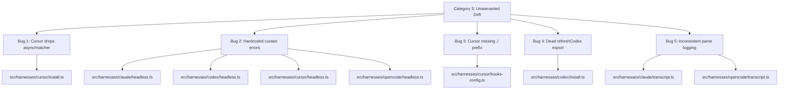
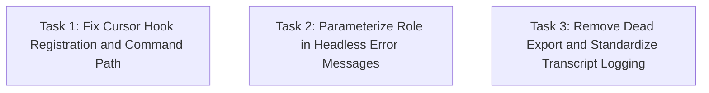

# Plan: Fix Category 3 Harness Drift (Unwarranted Bugs)

## Original Work Order

> Create a plan for Category 3 from .ai/task-manager/scratch/harness-drift-report.md

Category 3 ("Unwarranted drift — bugs from incomplete propagation") identifies 5 concrete bugs where copy-paste across harness adapters introduced inconsistencies or missing functionality. These are not duplication problems (Categories 1–2) or warranted differences (Category 4) — they are bugs.

## Plan Clarifications

| Question | Answer |
|----------|--------|
| How should hardcoded "curator" error messages be fixed? | Parameterize by role — pass the role name into the function and interpolate it into error messages |
| Should transcript parse error logging be standardized on warn or silence? | Standardize on `console.warn` across all 4 harnesses |
| Should missing refresh\*Templates exports be added preemptively? | Verify need first — `refreshCodexTemplates` is exported but never called (dead code); skip adding exports unless a real caller is found |

## Executive Summary

The harness drift report identified 5 bugs caused by incomplete propagation when features were copy-pasted across Claude, Codex, Cursor, and OpenCode adapters. These range from silently dropped hook spec fields (Cursor losing `async`/`matcher`) to misleading error messages (headless.ts hardcoding "curator" for all roles) to inconsistent logging behavior.

This plan addresses each bug as a targeted fix. No refactoring, no new abstractions — just aligning the adapters to consistent, correct behavior. The fixes are small and isolated, touching at most 4 files each.

## Context

### Current State vs Target State

| Current State | Target State | Why? |
|---|---|---|
| Cursor `install.ts` silently drops `async` and `matcher` fields from hook specs | Cursor spreads `async` and `matcher` like Claude and Codex do | Any hook declaring `async: true` or a `matcher` in Cursor will silently fail to register those properties |
| `headless.ts` error messages hardcode "curator" in Claude/Codex/Cursor | Error messages include the actual role name (curator, proposal, or bootstrap) | Misleading errors make debugging harder when bootstrap or proposal calls fail |
| Cursor `hooks-config.ts` uses `node ${hook.scriptPath}` (no `./` prefix) | Cursor uses `node ./${hook.scriptPath}` matching Codex | Inconsistency may cause path resolution issues depending on Node's module resolution |
| Claude and OpenCode silently swallow transcript parse errors | All 4 harnesses log malformed lines via `console.warn` | Silent failures make debugging transcript parsing issues impossible |
| `refreshCodexTemplates` is exported but never called; Cursor/OpenCode lack the export entirely | Dead export removed from Codex; no exports added to Cursor/OpenCode unless a real caller is identified | Dead code adds confusion; adding unused exports would create more dead code |

### Background

The drift report (`harness-drift-report.md`) was produced by auditing the 4 harness adapters for divergence. Categories 1 and 2 (duplication and partial centralization) are addressed by Plans 36 and 37 respectively. Category 4 documents warranted differences. This plan covers Category 3 — the bugs.

Recent commits (`05b352e`, prior centralization work) focused on Categories 1–2. All 5 Category 3 bugs were verified to still exist in the current codebase as of 2026-05-26.

## Architectural Approach

Each fix is a surgical, isolated change. No shared infrastructure is being introduced — each bug is fixed in the specific file(s) where it occurs.



### Bug 1: Cursor `install.ts` Drops `async` and `matcher` from Hook Specs

**Objective**: Ensure Cursor hook registration preserves all spec fields, matching Claude and Codex behavior.

The fix adds the two missing spread lines in the `cursorHookSpecs.map()` callback in `src/harnesses/cursor/install.ts` (around line 34–40):

```typescript
cursorHookSpecs.map(spec => ({
  event: spec.event,
  scriptPath: `.cursor/hooks/${spec.scriptPath}`,
  ...(spec.async ? { async: true } : {}),
  ...(spec.matcher ? { matcher: spec.matcher } : {}),
}))
```

### Bug 2: Parameterize Role Name in `headless.ts` Error Messages

**Objective**: Make headless error messages accurately reflect which role (curator, proposal, bootstrap) actually failed.

In Claude, Codex, and Cursor `headless.ts`, the function that validates headless output hardcodes "curator" or "proposal" in error messages. The function should accept the role name as a parameter and interpolate it:

- `"curator output was not valid JSON"` → `"${role} output was not valid JSON"`
- `"proposal output did not match schema"` → `"${role} output did not match schema"`

OpenCode already uses a different message format (`"Could not parse opencode output as JSON"`) — it should also be parameterized to use the role name for consistency.

### Bug 3: Cursor `hooks-config.ts` Missing `./` Prefix

**Objective**: Align Cursor's command path format with Codex to prevent potential path resolution issues.

In `src/harnesses/cursor/hooks-config.ts` (line 88), change:
```typescript
command: `node ${hook.scriptPath}`,
```
to:
```typescript
command: `node ./${hook.scriptPath}`,
```

### Bug 4: Remove Dead `refreshCodexTemplates` Export

**Objective**: Remove unused code rather than propagating it to more harnesses.

`refreshCodexTemplates` is exported from `src/harnesses/codex/install.ts` (lines 59–64) but never imported or called anywhere. Rather than adding matching dead exports to Cursor and OpenCode, remove the dead export from Codex. If a real need for per-adapter refresh functions emerges later, it should be added with an actual caller.

### Bug 5: Standardize Transcript Parse Error Logging

**Objective**: Ensure all harnesses warn on malformed transcript lines for debuggability.

Add `console.warn` logging to the `catch` blocks in:
- `src/harnesses/claude/transcript.ts` (around line 43–46) — currently silent `catch {}`
- `src/harnesses/opencode/transcript.ts` (around lines 77–80 and 96–99) — currently silent `catch {}`

The warning format should match the existing pattern in Codex/Cursor:
```typescript
console.warn(
  `parse<Harness>Transcript: skipping malformed JSONL line: ${(err as Error).message}`
);
```

## Risk Considerations and Mitigation Strategies

<details>
<summary>Technical Risks</summary>

- **Bug 1 (async/matcher) could change runtime behavior if a Cursor hook spec actually declares these fields**: Currently no Cursor hook spec uses `async` or `matcher`, so this is a latent bug with no immediate runtime effect. The fix is still necessary to prevent silent failures when specs are added in the future.
    - **Mitigation**: Verify that no existing Cursor hook spec uses `async` or `matcher` before applying, confirming the fix is behavior-preserving today.

- **Bug 3 (`./` prefix) may affect path resolution differently across OS/Node versions**: The `./` prefix is only significant for ES module resolution; CommonJS `require` handles both. Since these are spawned as `node <path>`, the prefix should not affect behavior.
    - **Mitigation**: Run existing tests after the change. If no tests cover this path, verify manually that Cursor hooks still execute.
</details>

<details>
<summary>Implementation Risks</summary>

- **Bug 2 (parameterized role) requires identifying all call sites**: The headless validation function is called from multiple places per harness. Each call site must pass the correct role.
    - **Mitigation**: Grep for all usages of the headless validation function across all 4 harnesses before modifying the signature.

- **Bug 4 (removing dead export) may break an external consumer**: If any external package imports `refreshCodexTemplates`, removing it would be a breaking change.
    - **Mitigation**: Search for imports across the full repo and published package types. The function is not part of the public API surface.
</details>

## Success Criteria

### Primary Success Criteria

1. All existing tests pass after the fixes
2. Cursor hook specs correctly register `async` and `matcher` fields when present
3. Headless error messages include the actual role name in all 4 harnesses
4. Cursor hook command paths include the `./` prefix
5. No dead `refreshCodexTemplates` export exists in Codex's install.ts
6. All 4 transcript parsers log `console.warn` on malformed lines

## Self Validation

- Run `npx vitest run` to confirm all existing tests pass
- Grep for hardcoded `"curator output"` strings across all harness headless files — should return zero matches
- Grep for `refreshCodexTemplates` — should only appear in git history, not in current code
- Verify `src/harnesses/cursor/install.ts` includes `async` and `matcher` spreads by reading the file
- Verify `src/harnesses/cursor/hooks-config.ts` uses `node ./` prefix by reading the file
- Verify `src/harnesses/claude/transcript.ts` and `src/harnesses/opencode/transcript.ts` contain `console.warn` in their catch blocks

## Documentation

No documentation updates required. These are internal bug fixes with no user-facing API changes.

## Resource Requirements

### Development Skills

- TypeScript — all changes are in `.ts` files
- Familiarity with the harness adapter architecture (`src/harnesses/`)

### Technical Infrastructure

- Node.js and Vitest for running tests
- The project's existing test suite for regression validation

## Execution Blueprint

**Validation Gates:**
- Reference: `/config/hooks/POST_PHASE.md`

### Dependency Diagram



All tasks are independent — no inter-task dependencies.

### ✅ Phase 1: Fix All Harness Drift Bugs
**Parallel Tasks:**
- ✔️ Task 1: Fix Cursor hook registration (async/matcher spreads) and command path (./prefix)
- ✔️ Task 2: Parameterize role name in headless error messages across all 4 adapters
- ✔️ Task 3: Remove dead refreshCodexTemplates export and add console.warn to transcript parsers

### Post-phase Actions
- Run full test suite (`npx vitest run`) to confirm no regressions
- Run grep validations from the plan's Self Validation section

### Execution Summary
- Total Phases: 1
- Total Tasks: 3

## Execution Summary

**Status**: ✅ Completed Successfully
**Completed Date**: 2026-05-26

### Results
All 5 Category 3 harness drift bugs fixed across 18 files (source + tests):
- Cursor `install.ts` now spreads `async` and `matcher` from hook specs
- All 4 headless adapters parameterize the role name in error messages via `opts.role`
- Cursor `hooks-config.ts` uses `node ./` prefix matching Codex
- Dead `refreshCodexTemplates` export removed from Codex `install.ts`
- Claude and OpenCode transcript parsers now log `console.warn` on malformed lines

### Noteworthy Events
- Task 2 agent chose to add `role?: string` to the shared `HeadlessRunOptions` type rather than adding a positional parameter to each function — this is a cleaner design that keeps all 4 adapter signatures stable. Default is `'headless'`; `proposal-drain.ts` passes `'proposal'`.
- Two new tests were added for the role parameterization (custom role in error messages), bringing the total from 409 to 411 tests.
- The `writeCursorHooksConfig` function signature was also updated to accept `matcher?` and `async?` optional fields, ensuring the type system enforces the newly-spread fields.

### Necessary follow-ups
None identified. All self-validation checks pass, all 411 tests pass, no dead code or tech debt remains.
