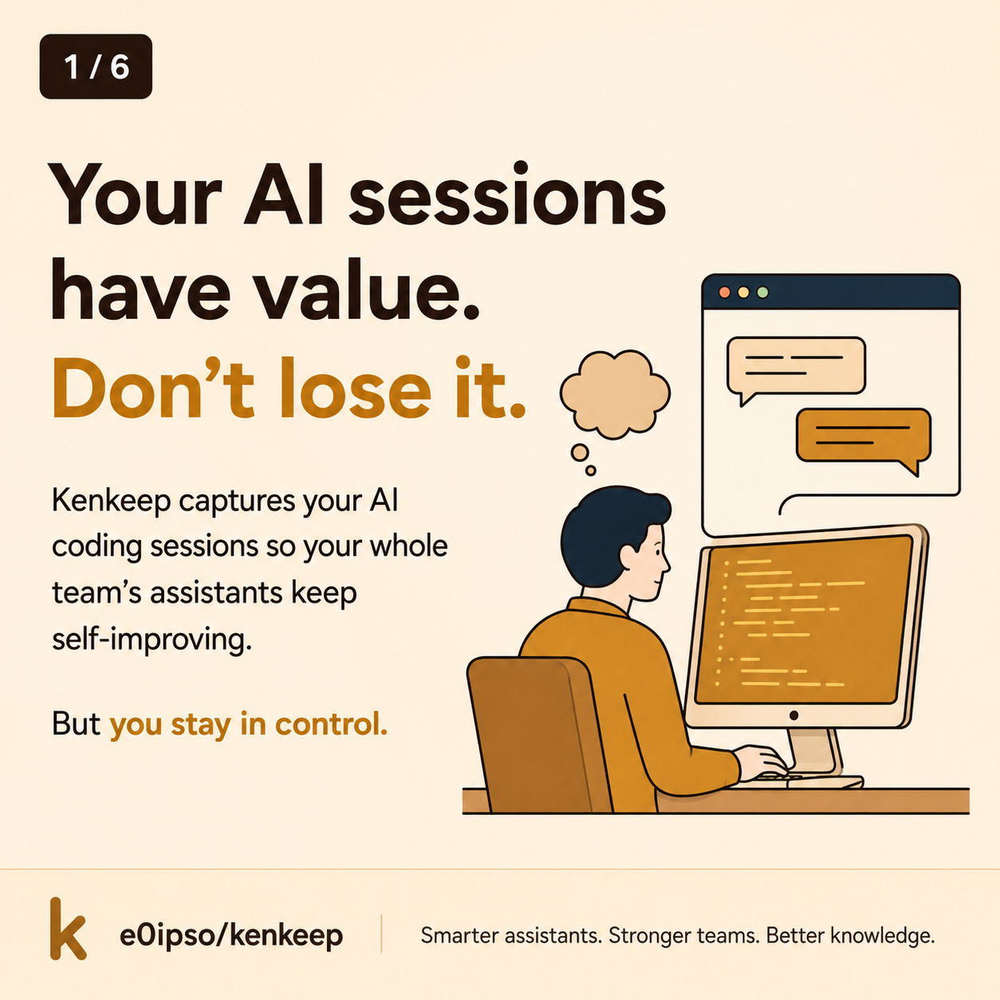
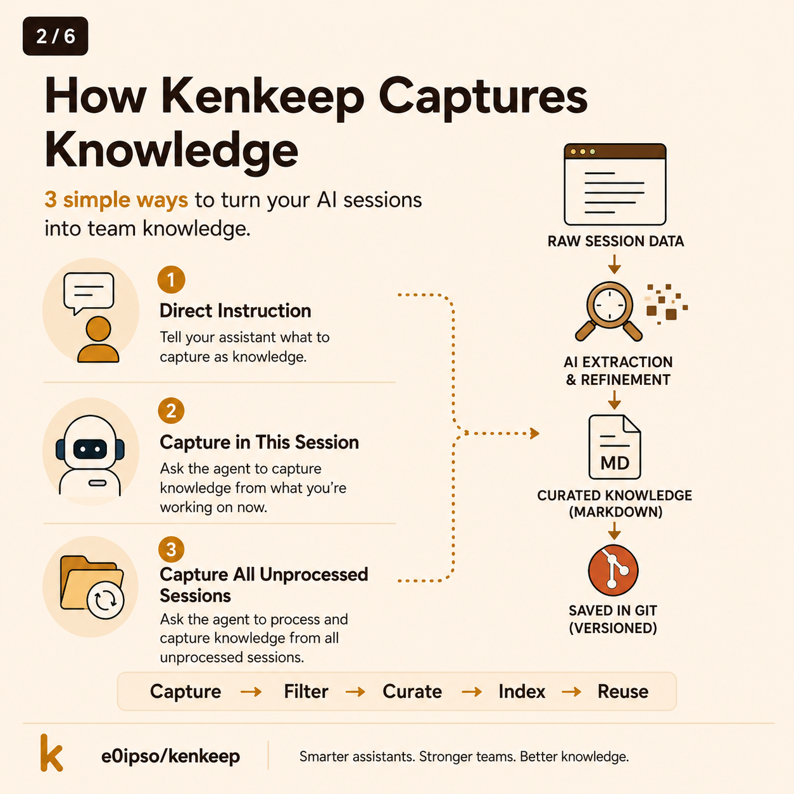
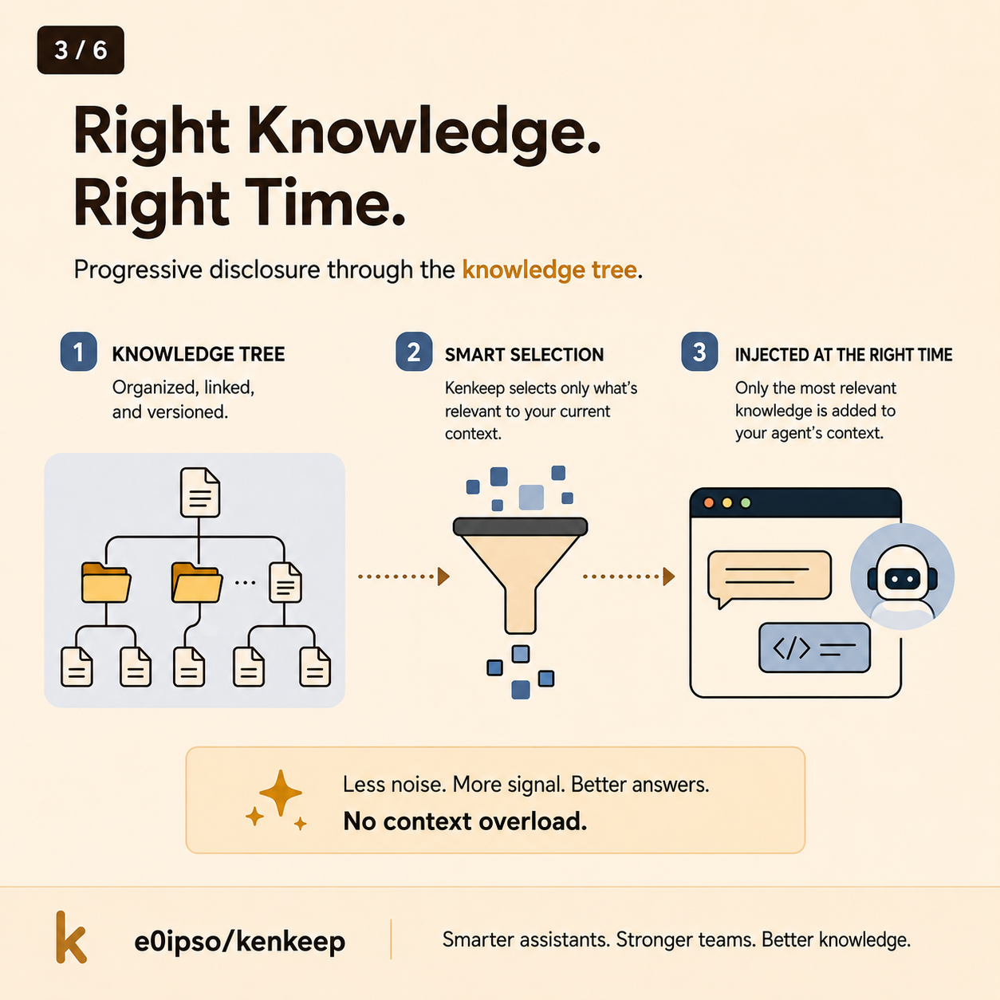
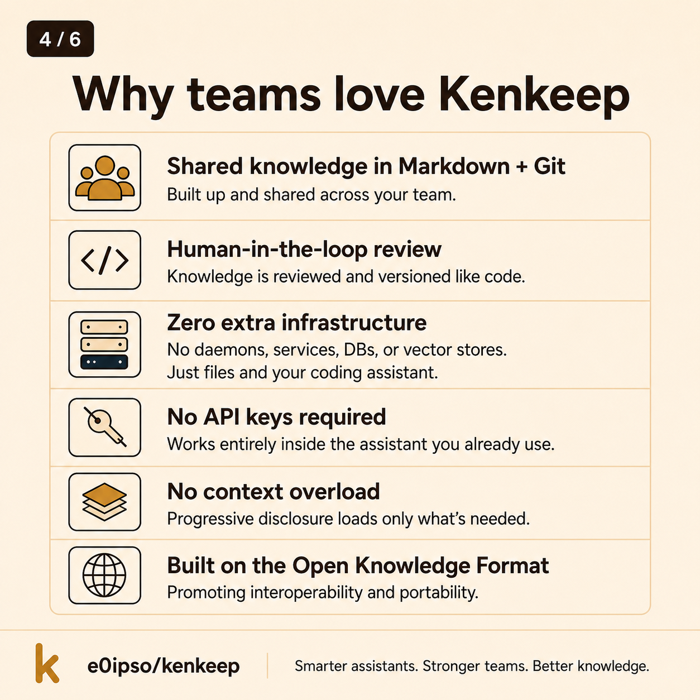
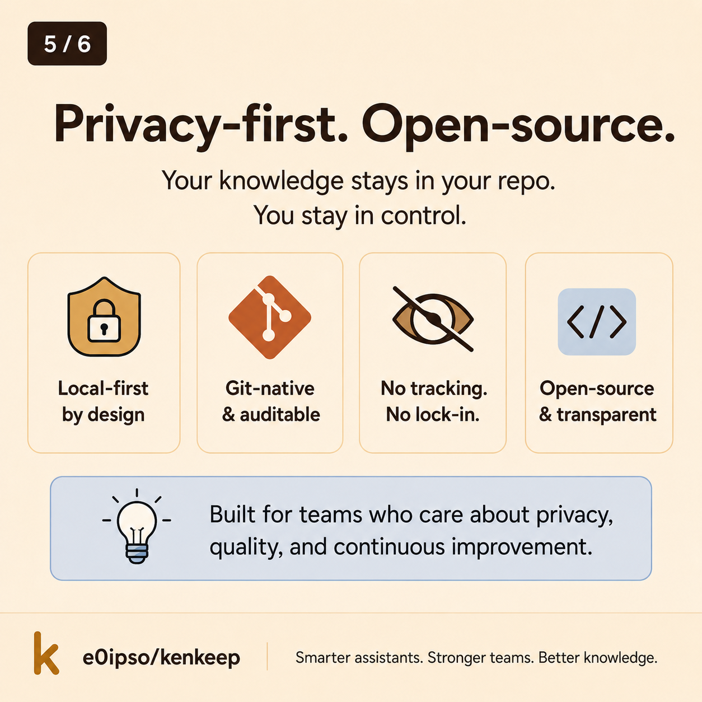
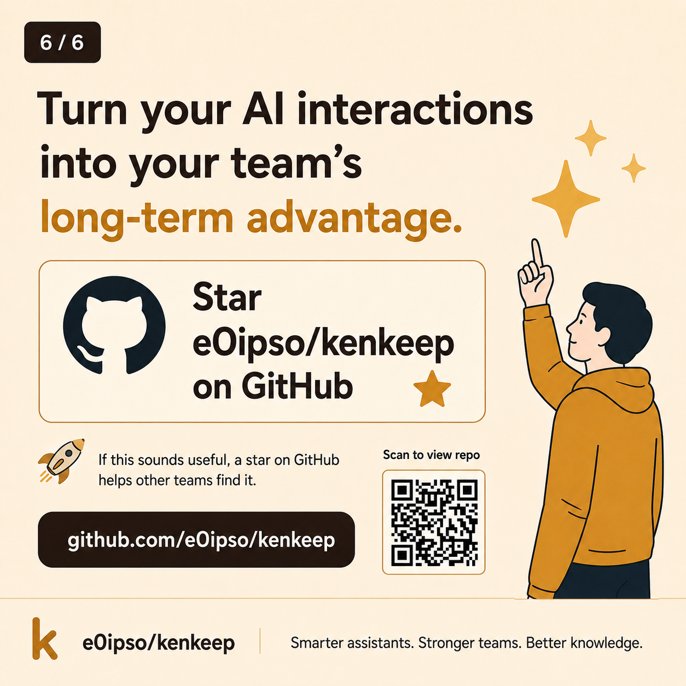
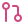
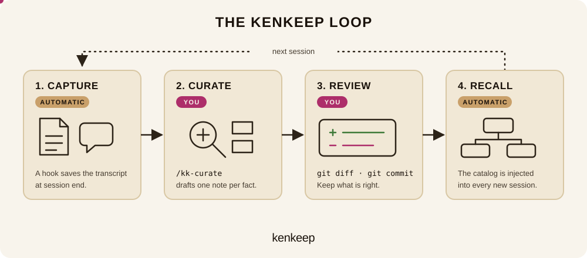

<p align="center">
  
</p>

<h1 align="center">kenkeep</h1>

<p align="center">
  <strong>A team-shared, git-native knowledge base for AI coding sessions.</strong><br>
  Built up in your repo, reviewed and versioned like code, with no extra infrastructure to run.
</p>

<p align="center">
  <a href="https://www.npmjs.com/package/kenkeep"></a>
  <a href="https://github.com/e0ipso/kenkeep/actions/workflows/test.yml"></a>
  <a href="package.json"></a>
  <a href="LICENSE"></a>
</p>

<p align="center">
  <a href="https://kenkeep.canpicasoft.com/how-it-works.html">How it works</a> &nbsp;·&nbsp;
  <a href="https://kenkeep.canpicasoft.com/installation.html">Installation</a> &nbsp;·&nbsp;
  <a href="https://kenkeep.canpicasoft.com/daily-use.html">Daily use</a> &nbsp;·&nbsp;
  <a href="https://kenkeep.canpicasoft.com/knowledge-packs.html">Knowledge packs</a> &nbsp;·&nbsp;
  <a href="https://kenkeep.canpicasoft.com/troubleshooting.html">Troubleshooting</a>
</p>

---

Coding assistants forget everything between sessions. Kenkeep **salvages the gold nuggets from your past conversations** and discards the rest, so the detail you explained two weeks ago is there the next time the assistant needs it.

Kenkeep is a **team-shared, git-native knowledge base** for AI coding assistants. Conventions, gotchas, module names, and the reasons behind decisions get captured from your sessions, curated by a human, committed to the repo, and injected back into every future session.

## Overview

<table>
<tr>
<td width="33%" valign="top">
<a href="docs/assets/images/kenkeep-slide-01.png">

</a>
</td>
<td width="33%" valign="top">
<a href="docs/assets/images/kenkeep-slide-02.png">

</a>
</td>
<td width="33%" valign="top">
<a href="docs/assets/images/kenkeep-slide-03.png">

</a>
</td>
</tr>
<tr>
<td width="33%" valign="top">
<a href="docs/assets/images/kenkeep-slide-04.png">

</a>
</td>
<td width="33%" valign="top">
<a href="docs/assets/images/kenkeep-slide-05.png">

</a>
</td>
<td width="33%" valign="top">
<a href="docs/assets/images/kenkeep-slide-06.png">

</a>
</td>
</tr>
</table>

## Why kenkeep

<table>
<tr>
<td width="50%" valign="top">


### Built up and shared across your team

One markdown file per fact, accumulated from real coding sessions and stored in your repo. It travels with `git pull`, so every teammate works from the same conventions instead of rediscovering them alone. The `nodes/` tree is an [Open Knowledge Format](https://github.com/GoogleCloudPlatform/knowledge-catalog/blob/main/okf/SPEC.md) bundle any OKF tool can read.

</td>
<td width="50%" valign="top">



### Reviewed and versioned like code

Nothing reaches the knowledge base without a human approving it. Every addition is an ordinary git diff you review in a commit or PR, with the full history there to blame or revert.

</td>
</tr>
<tr>
<td width="50%" valign="top">


### No extra infrastructure

No daemons, services, databases, or vector stores. Kenkeep is Node and git. Nothing to provision, host, keep alive, or secure.

</td>
<td width="50%" valign="top">


### No API keys

It runs inside the assistant you already pay for: Claude Code, Codex, Cursor, OpenCode, or Copilot. There is no separate key to obtain, store, or rotate.

</td>
</tr>
</table>

## How it works

<p align="center">
  
</p>

- **Capture** is automatic. When a session ends, a hook saves the transcript.
- **Curate** is yours to start. Run `/kk-curate` and the assistant drafts one note per durable fact, then walks you through any contradiction with a note you already have.
- **Review** is yours to decide. Read the notes with `git diff` and commit the ones you want.
- **Recall** is automatic. Every new session starts with the root catalog and descends only into the notes the task needs, so the payload stays small as the base grows.

<p align="center">
  
</p>

Full walkthrough: [How it works](https://kenkeep.canpicasoft.com/how-it-works.html).

## Quick start

```sh
npx kenkeep init --harnesses claude
npx kenkeep doctor
```

Swap `claude` for `codex`, `cursor`, `opencode`, or `copilot`, or pass a comma-separated list. Per-harness details, including where GitHub Copilot CLI keeps its hooks and skills, are in [Installation](https://kenkeep.canpicasoft.com/installation.html).

Then code as usual. When the assistant nudges you, run `/kk-curate` in your session. New notes land under `.ai/kenkeep/nodes/`. Review them with `git diff` and commit the ones you want to keep.

<table>
<tr>
<td width="50%" valign="top">


### Seed from existing docs

If your repo already has READMEs, ADRs, or module docs, seed the knowledge base from them. Inside a session:

```
/kk-bootstrap
```

The scan starts at the repo root and honors `.kkignore`, which `init` creates with [gitignore syntax](https://git-scm.com/docs/gitignore). Review the resulting notes with `git diff` and commit the ones you want.

</td>
<td width="50%" valign="top">


### Add knowledge manually

Mid-session, mention `/kk-add` and the assistant records the point you just made:

```
No, you got that wrong.

This project aims to maximize code
re-use, instead of duplication. Adapt
and extend the abstractions to fit
this use case. Also, /kk-add this.
```

</td>
</tr>
</table>

## Knowledge packs

A pack is a reviewed `nodes/` tree published for a framework, platform, or shared domain. Import one and it lands as a single isolated branch in your own knowledge base:

```sh
npx kenkeep pack import e0ipso/kenkeep-pack-drupal
npx kenkeep pack import https://github.com/e0ipso/kenkeep-pack-drupal --as drupal
```

Import is deterministic and never calls an LLM. Colliding note ids are skipped with a warning. Full guide: **[Knowledge packs](https://kenkeep.canpicasoft.com/knowledge-packs.html)**.

## Documentation

Full documentation: **<https://kenkeep.canpicasoft.com>**

Working on the package itself? See [CONTRIBUTING.md](CONTRIBUTING.md).

## License

[MIT](LICENSE)
