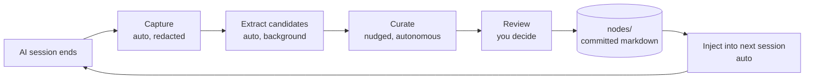

# How it works

Three things happen on a loop. You only ever drive one of them by hand — and even that one mostly drives itself.

## 1. Capture (automatic)

When a Claude Code session ends, a hook reads the transcript, runs it through [secretlint](https://github.com/secretlint/secretlint) (with the recommended preset) to redact secrets, and writes it to `.ai/knowledge-base/_sessions/`. Then a background extractor turns that transcript into structured _candidates_ — small bits of practice or vocabulary worth remembering.

You don't run this. It just happens.

## 2. Curate (mostly automatic)

When captured candidates accumulate, the system nudges you in the next session. You confirm (or run `/kb-curate` directly), and the curator runs autonomously as a `claude -p` subprocess — it reads pending candidates, merges them against existing nodes, and writes three kinds of _proposals_ under `.ai/knowledge-base/_proposed/`:

- **Additions** — new things to remember.
- **Modifications** — updates to something already kept.
- **Contradictions** — the new candidate disagrees with something already kept.

The curator only stops to ask you when the merge is genuinely ambiguous. As part of the same run, it regenerates `INDEX.md` and `GRAPH.md` deterministically (no LLM) so the index and proposals stay in lockstep.

## 3. Review (you decide)

Review the changes to the `.ai/knowledge-base/` directory. They are important — they may affect how the agent behaves in every future session. You can use a tool like [self-review](https://github.com/e0ipso/self-review) to walk the diff and capture any feedback before committing.

## Storage & graph

Every kept fact is a markdown file under `nodes/` with YAML frontmatter. Two kinds:

- **Practice** — _how we build._ Imperative guidance: conventions, prohibitions, gotchas.
- **Map** — _what exists._ Named things: modules, services, vocabulary.

Frontmatter carries the edges of a directed graph: `supersedes` / `superseded_by` for versioning, `derived_from` for provenance, `relates_to` (loose) and `depends_on` (strict) for cross-references. Two artifacts are regenerated deterministically from `nodes/` every curate run:

- **`INDEX.md`** — slim, token-budgeted view. This is what gets injected into every new session.
- **`GRAPH.md`** — full edge listing. Not injected; the assistant reads it on demand when it needs the whole graph.

Everything is plain text, diffable, reviewable, version-controlled like any code. The full frontmatter shape lives in [Schemas](internals/schemas.md).

## What's automatic vs. manual

| Step | Trigger | Who runs it |
|---|---|---|
| Capture session | session end (hook) | automatic |
| Extract candidates | capture completes | automatic (background) |
| Curate → proposals | system nudge or `/kb-curate` | autonomous AI (asks only when ambiguous) |
| Regenerate `INDEX.md` / `GRAPH.md` | end of curate run | automatic (deterministic) |
| Review changes to `.ai/knowledge-base/` | when proposals exist | **you** (any diff tool, e.g. [self-review](https://github.com/e0ipso/self-review)) |
| Inject `INDEX.md` into new sessions | session start | automatic |

The cheap deterministic steps and the bulk-AI steps run on their own. The one place we keep humans in the loop is reviewing what to keep.
