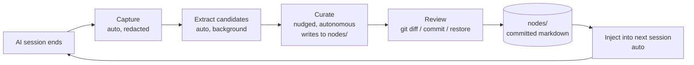

# How it works

Three things happen on a loop. You only ever drive one of them by hand, and even that one mostly drives itself.

## 1. Capture (automatic)

When an AI session ends, a hook reads the transcript, runs it through [secretlint](https://github.com/secretlint/secretlint) (with the recommended preset) to redact secrets, and writes it to `.ai/knowledge-base/_sessions/`. Then a background extractor turns that transcript into structured _candidates_ (small bits of practice or vocabulary worth remembering).

You don't run this. It just happens.

Per-harness wiring details (which events fire, where hooks live) are in [Installation](installation.md). Curation and review behave identically across all four harnesses.

## 2. Curate (mostly automatic)

When captured candidates accumulate, the system nudges you in the next session. You confirm (or run `/kb-curate` directly), and the curator runs autonomously as a `claude -p` subprocess: it reads pending candidates, compares them to existing nodes, and applies its decisions directly to `.ai/knowledge-base/nodes/`:

- **Additions**: write a new node file.
- **Modifications**: overwrite an existing node file.
- **Contradictions**: record each conflict as `.ai/knowledge-base/conflicts/<id>.md` with `status: pending` and write nothing to `nodes/`. The `/kb-curate` skill reads those files after the curator exits and walks each one with you in-session, grouping by `target_node_id`. You reply with a single character: `y` to accept the proposal, `n` to reject it, `s` to defer to the next pass, or `k` to keep the conflict file as a historical record.

As part of the same run, the curator regenerates `INDEX.md` and `GRAPH.md` deterministically (no LLM) so the index reflects the current `nodes/` tree.

## 3. Review (you decide)

Review the changes under `.ai/knowledge-base/nodes/` with `git diff`. They are important; they may affect how the agent behaves in every future session. Tools like [self-review](https://github.com/e0ipso/self-review) work too. Accept with `git commit`, reject with `git restore <path>`. The lint-staged pre-commit hook regenerates `INDEX.md` and `GRAPH.md` and stages them into the same commit so the index never drifts from the committed nodes.

## Storage & graph

Every kept fact is a markdown file under `nodes/` with YAML frontmatter. Two kinds:

- **Practice**: _how we build._ Imperative guidance (conventions, prohibitions, gotchas).
- **Map**: _what exists._ Named things (modules, services, vocabulary).

Frontmatter carries the edges of a directed graph: `derived_from` for provenance, `relates_to` (loose) and `depends_on` (strict) for cross-references. Two artifacts are regenerated deterministically from `nodes/` every curate run:

- **`INDEX.md`**: catalog of every node (title, path, and tags). This is what gets injected into every new session.
- **`GRAPH.md`**: full edge listing. Not injected; the harness reads it on demand when it needs the whole graph.

Everything is plain text, diffable, reviewable, version-controlled like any code. The full frontmatter shape lives in [Schemas](internals/schemas.md).

## What's automatic vs. manual

| Step | Trigger | Who runs it |
|---|---|---|
| Capture session | session end (hook) | automatic |
| Extract candidates | capture completes | automatic (background) |
| Curate → write to `nodes/` | system nudge or `/kb-curate` | autonomous AI (asks only when contradicting) |
| Resolve contradictions | curator writes a file under `.ai/knowledge-base/conflicts/` | `/kb-curate` skill walks each one with **you** (`y`/`n`/`s`/`k`) |
| Regenerate `INDEX.md` / `GRAPH.md` | end of curate run + every commit (lint-staged) | automatic (deterministic) |
| Review changes to `nodes/` | whenever the curator wrote something | **you** (`git diff`, `git restore`, `git commit`) |
| Inject `INDEX.md` into new sessions | session start | automatic |

The cheap deterministic steps and the bulk-AI steps run on their own. The one place we keep humans in the loop is reviewing what to keep.
