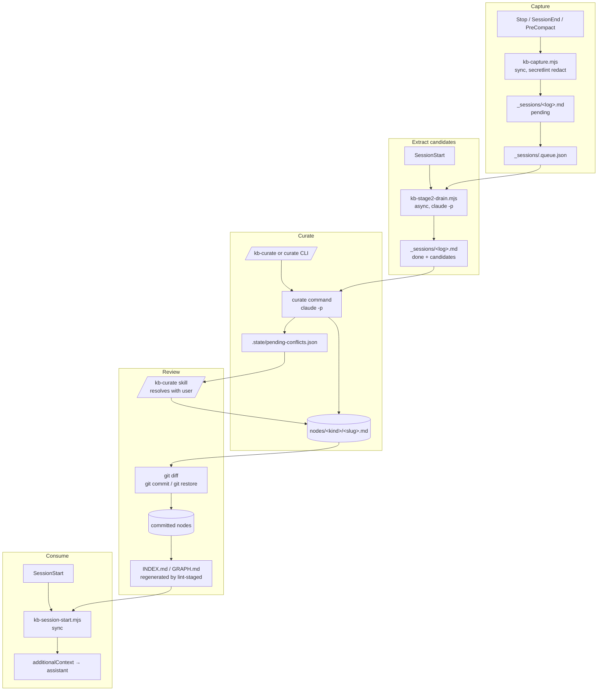

# Architecture

## Layout

```
src/
├── cli.ts                       # Commander entry
├── commands/                    # User-facing CLI implementations
├── hooks/                       # Compiled-to-.mjs hook scripts
│   ├── kb-capture.ts            # capture     (Stop/SessionEnd/PreCompact)
│   ├── kb-stage2-drain.ts       # extraction  (SessionStart, async)
│   └── kb-session-start.ts      # consume     (SessionStart, sync)
├── lib/                         # Reusable building blocks
├── adapters/                    # Adapter interface
└── templates-source/            # Files copied into consumer repos
```

`tsup` builds `dist/cli.js` (CLI binary) and `dist/hooks/*.mjs` (one bundle per hook). The `prepare` script copies `templates-source/` to `templates/` and drops compiled hooks into `templates/claude/hooks/`. The npm package ships `dist/` and `templates/`.

## Two CLI shapes

- **Deterministic**: `init`, `doctor`, `status`, `node add`, `index rebuild`. No LLM.
- **LLM-invoking**: `curate`, `bootstrap-incremental`. Spawn `claude -p` via `runHeadlessClaude`, parse stream-JSON, validate with Zod. All subprocesses set `KB_BUILDER_INTERNAL=1`.

## Pipelines



## State files

| File | Owner | Purpose |
|---|---|---|
| `_sessions/<log>.md` | capture, extract, curate | Per-session checkpoint. |
| `_sessions/.queue.json` | capture, extract | Stage-1 → stage-2 handoff. |
| `_sessions/.dedup-cache.json` | capture | 5-min SHA-256 window. |
| `_logs/{stage-2,curator,bootstrap-incremental}/*.jsonl` | LLM pipelines | Stream-JSON traces. Gitignored. |
| `nodes/{practice,map}/` | curator, node-add, bootstrap, human reviewer | Canonical knowledge. Reviewed via `git diff` and accepted via `git commit`. |
| `INDEX.md` / `GRAPH.md` | curator, index-rebuild (incl. lint-staged `--stage`) | Deterministic outputs derived from `nodes/`. Regenerated and staged on every commit. |
| `.state/installed-version` | init | Package version + selected assistants. Committed. |
| `.state/state.json` | drain, curator, bootstrap, consume | Lock + `last_nudged_at`. Gitignored. |
| `.state/bootstrap-state.json` | bootstrap | Doc SHA-256 cache. Gitignored. |
| `.state/pending-conflicts.json` | curator (write), kb-curate skill (resolve), status (read) | Curator-detected contradictions awaiting in-session resolution. |
| `.config/prompts/*` | init | Local prompt overrides. Committed. |

## Locking

`state.json` holds one lock at a time (`name`, `pid`, `acquired_at`, `ttl_ms`). 30-min TTL; stale locks are reclaimed.

- `stage2-drain`: prevents concurrent SessionStart drains racing on the queue.
- `curator`: prevents duplicate proposals from concurrent curate runs.
- `bootstrap-incremental`: same, for bootstrap.

Consume doesn't lock.

## Determinism contract

- `computeNodesHash` is content-addressed and mtime-independent.
- `generateIndex` / `generateGraph` are pure functions of `nodes/` plus an injected `now`.
- `slugify`, `deriveNodeId`, `ensureUniqueId` are pure.
- ULID is the only randomness, scoped to `run_id` minting.

Tests rely on this. See `tests/lib/index-gen.test.ts` for golden-file comparisons.

## Adapter interface

`src/adapters/types.ts`:

```ts
interface Adapter {
  name: string;
  hookInstallPath(): string;
  skillInstallPath(): string;
  writeHookConfig(repoRoot: string, hooks: HookSpec[]): Promise<void>;
  readTranscript(hookInput: unknown): Promise<RoleTaggedTranscript>;
  runHeadless<T>(promptBody: string, stdin: string, schema: ZodSchema<T>, opts?: HeadlessOpts): Promise<T>;
  renderSkill(spec: SkillSpec): string;
}
```

Adding an adapter: implement the methods, dispatch from `init.ts`.

## Testing

- **Unit + integration** (`npm test`) — pure-function tests for `src/lib/`, plus pipeline integration tests against a fake runner. CLI integration tests build the package and run the binary in a temp-dir sandbox. ~10s.
- **Manual** — see [Manual test plan](manual-test-plan.md).

## Where to extend

| Goal | Path |
|---|---|
| Change extraction | `templates-source/prompts/stage-2-extract.md` |
| Change curator | `templates-source/prompts/curator.md` (logic in `src/lib/curate.ts`) |
| Change bootstrap | `templates-source/prompts/bootstrap-incremental.md` or skill body |
| New CLI subcommand | `src/commands/<name>.ts` + wire in `src/cli.ts` + doc in `cli-reference.md` |
| New hook | `src/hooks/<name>.ts` + `tsup.config.ts` + register in `init.ts` |
| New state file | Schema in `src/lib/schemas.ts`; add to gitignore block |
| New adapter | Implement `src/adapters/types.ts`; dispatch from `init.ts` |
