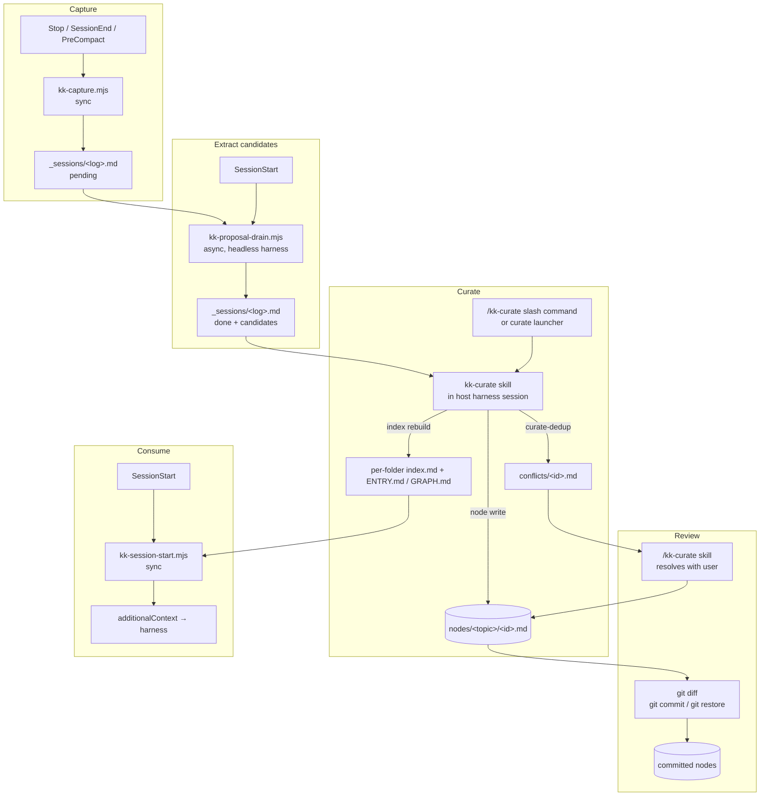

# Architecture

## Layout

```
src/
├── cli.ts                       # Commander entry
├── commands/                    # User-facing CLI implementations
├── hooks/                       # Compiled-to-.mjs hook scripts
│   ├── kk-capture.ts            # capture     (Stop/SessionEnd/PreCompact)
│   ├── kk-proposal-drain.ts     # extraction  (SessionStart, async)
│   └── kk-session-start.ts      # consume     (SessionStart, sync)
├── lib/                         # Reusable building blocks
├── adapters/                    # Adapter interface
└── templates-source/            # Files copied into consumer repos
```

**Build:** `tsup` produces `dist/cli.js` (CLI binary) and `dist/hooks/*.mjs` (one bundle per hook). The `prepare` script copies `templates-source/` to `templates/` and drops compiled hooks into `templates/claude/hooks/`. The npm package ships `dist/` and `templates/`.

## Two CLI shapes

- **Deterministic primitives:** `init`, `doctor`, `status`, `lint`, `finddocs`, `node write`, `curate-dedup`, `index rebuild`, `logs prune`. No LLM. Pure Node helpers; skills compose them, CI/scripts may call them directly.
- **Launchers:** `bootstrap`, `curate`, `node add`. Thin wrappers that exec `<harness> -p "/kk-<name>"` with `KENKEEP_BUILDER_INTERNAL=1` set on the child. The LLM call runs in the host harness session, not in a subprocess spawned by this CLI.

**Model config:** the proposal-drain hook's model and effort are set via `proposalModel: { name, effort }` in `config.yaml`. Curate and bootstrap run under whatever model the host harness session uses.

The one headless-subprocess site is the **proposal-drain hook**, which spawns the active harness's headless driver (`codex exec`, `agent -p`, `opencode run`, `copilot -p`, …) per captured session log to extract candidates.


The **Claude adapter's drain hook is a deliberate no-op.** Spawning a headless subprocess would double-bill the user's Claude plan, so extraction instead runs inline during `/kk-curate`. Do not "fix" this hook to spawn a driver.



## Pipelines



## Parallel drafting and per-batch logs

When the host harness exposes native sub-agents (Claude Code and Cursor today), `/kk-bootstrap` and `/kk-curate` fan their drafting out across up to five sub-agents per wave, each reading its own slice in an isolated context. Harnesses without native sub-agents fall back to sequential drafting automatically: the skills probe their own tool surface at the start of each run and degrade silently, so a sequential run looks identical to a parallel one from the outside. `/kk-add` uses a single sub-agent only for context isolation, so the host transcript stays clean.

Each run drops a JSONL trace under `.ai/kenkeep/_logs/`, one file per batch (or one per run for `/kk-add`):

```
.ai/kenkeep/_logs/bootstrap/<runId>__<batchN>.jsonl
.ai/kenkeep/_logs/curator/<runId>__<batchN>.jsonl
.ai/kenkeep/_logs/kk-add/<runId>.jsonl
```

The parallel path additionally writes a `<runId>__<batchN>.draft.json` beside each `.jsonl`. If those are absent while `.jsonl` files exist, the sequential fallback ran. Everything under `_logs/` is gitignored: per-user diagnostic state, not something to commit.

## State files

| File | Owner | Purpose |
|---|---|---|
| `_sessions/<log>.md` | capture, extract, curate | Per-session checkpoint. Filename is `YYYYMMDD-HHmm-<sessionId>.md`; re-firing the hook for the same `session_id` overwrites in place. |
| `_logs/proposal/*.jsonl` | proposal-drain hook | Stream-JSON traces from the hook's headless subprocess (non-Claude adapters). Gitignored. |
| `nodes/` (nested topical folders) | curator, node-add, bootstrap, human reviewer | Canonical knowledge. Reviewed via `git diff` and accepted via `git commit`. |
| `ENTRY.md` / `GRAPH.md` | curator, `index rebuild` (incl. `--stage` for opt-in pre-commit hooks) | Deterministic outputs derived from `nodes/`. Regenerated by the curator at end-of-run; consumers may also wire `index rebuild --stage` into their own pre-commit hook. |
| `.state/installed-version` | init | Package version + selected harnesses. Committed. |
| `.state/state.json` | drain, curator, bootstrap, consume | Lock + `last_nudged_at`. Gitignored. |
| `.state/bootstrap-state.json` | bootstrap | Doc SHA-256 cache. Gitignored. |
| `conflicts/<run-id>-<n>.md` | curator (write), kk-curate skill (resolve), status (read) | Curator-detected contradictions, one markdown file per conflict. Frontmatter carries `status: pending`; resolution is via `git restore` (Reject / Accept-after-apply) or `git commit` (Keep as record). |
| `.config/prompts/*` | init | Local prompt overrides. Committed. |

## Locking

Only the **proposal-drain hook** locks. It holds a `state.json` lock (PID + 30-min TTL, stale locks reclaimed) to keep concurrent SessionStart drains from racing on the pending queue.

**Curate, bootstrap, and consume do not lock.** Curate and bootstrap each run in a single host harness session per user invocation (single-author by design); the atomic tmp+rename writes inside `node write` and `curate-dedup` provide durability.


Running two `curate` (or `bootstrap`) launchers against the same repo concurrently is **unsupported**. The second writer's session-stamp update may silently lose to the first: no data corruption, but some sessions reprocess on the next run.



## Knowledge base storage (tree over DAG)

Leaf nodes (the documents) live in topical folders under `.ai/kenkeep/nodes/` at any depth. Every folder carries a generated `index.md` (an **index node**): a deterministic, actionable table-of-contents that invites descent, ordered by graph in-degree then title. The top-level catalog `ENTRY.md` (the SessionStart entry point) is a purpose-built whole-tree launchpad — the branch list — distinct from the per-folder `nodes/index.md`; `GRAPH.md` is the full edge listing.

An index node body carries: an embedded one-line descent directive (from the single `KK_NAVIGATION_DIRECTIVE`), a `↑ Parent` breadcrumb on non-root nodes, imperative `Load [\`name/\`](…) for more information on <summary>` descent pointers and `Open [**title**](…) to learn about: <summary>` leaf pointers (valid Markdown links that splice the target's summary, Title-cased name fallback when absent), a reworked `## By topic`, and **no body statistics** (counts/token estimates are diagnostics, kept in frontmatter only).

- **Folder summary: authoring vs carrying vs rendering.** The single non-deterministic field is each folder's one-line `summary` (in `index.md` frontmatter; the root's in `ENTRY.md`). It is **authored** rarely and semantically by an LLM at exactly two quarantined clustering moments — the v1→v2 migration (the `kk-migrate` skill) and the `rebalance` split-folder/create-branch/split-leaf steps (humans may hand-edit) — **carried** deterministically by `generateIndex`, which harvests the prior on-disk value before regenerating and re-stamps it verbatim (a leaf edit never perturbs a sibling's summary), and **rendered** deterministically into the imperative pointers. A missing summary renders the Title-cased name fallback; `index rebuild` warns and exits zero (warn, never block).
- **Reworked `## By topic`.** For each tag present among a folder's direct leaves (bucket set/order unchanged: size DESC then alpha), it lists the ≤3 most-central nodes drawn from the **whole tree** carrying that tag, ranked by centrality = summed tag Jaccard (`|A∩B|/|A∪B|`) against the rest of that tag's whole-tree cohort, tie-broken by in-degree then title. Each entry is a followable `Open [**title**](path) — <summary>`. The block points OUT to the canonical nodes per topic instead of re-listing the local components.
- **`kind` is a facet, not a directory.** `kind` (`map` / `practice`) drives only the Conventions / Components rendering split; folders are topical.
- **Tree over DAG.** Containment is a tree (one parent folder per leaf); `relates_to` / `depends_on` stay a cross-tree DAG overlay, resolved by `id`.
- **Path is presentation; `id` is identity.** No node references another by path; index generation resolves each `id` to its current path, so relocation never breaks a reference. `generateIndex` returns one `index.md` body per directory plus per-folder metrics (occupancy, tag diversity, leaf size); the metrics feed `rebalance` but are no longer printed in the body.
- **`nodes_hash` excludes generated `index.md`.** The per-folder `nodes_hash` covers that folder's own direct leaves only; hashing the generated index nodes would be self-referential, and the whole-tree `## By topic` block is deliberately excluded from it so cross-tree churn reorders the rendered block without perturbing an unrelated folder's stability hash.
- **No schema bump.** The `summary` field folds into the unreleased `schema_version: 2` index frontmatter (added optional); there is no v3 hop. The reader still rejects the old flat `nodes/<kind>/` layout (or `schema_version: 1`) with a migrate message that now points at the `kk-migrate` skill, which preserves ids and edges. The headless `migrate` command (which spawned a nested `<harness> -p` to cluster) has been removed: the in-host `kk-migrate` skill performs the clustering in the user's current session and drives the deterministic `place` primitive (inventory + apply) for all file I/O, so a full migration now requires an interactive agent session.

## Determinism contract

- `computeNodesHash` is content-addressed, mtime-independent, and over leaf nodes only (generated `index.md` files are excluded).
- `generateIndex` emits one deterministic `index.md` body per directory; `generateIndex` / `generateGraph` are pure functions of `nodes/` plus an injected `now`. Repeated rebuilds over an unchanged leaf set are byte-identical.
- `slugify`, `deriveNodeId`, `ensureUniqueId` are pure.
- `crypto.randomUUID()` is the only randomness, scoped to `run_id` minting.



## Adapter interface

`src/harnesses/types.ts`:

```ts
interface HarnessAdapter {
  name: string;
  hookInstallPath(): string;
  skillInstallPath(): string;
  writeHookConfig(repoRoot: string, hooks: HookSpec[]): Promise<void>;
  readTranscript(hookInput: unknown): Promise<RoleTaggedTranscript>;
  runHeadless<T>(promptBody: string, stdin: string, schema: ZodSchema<T>, opts?: HeadlessOpts): Promise<T>;
  renderSkill(spec: SkillSpec): string;
}
```

`runHeadless` spawns the harness's `-p` non-interactive mode. It has exactly two consumers: the **proposal-drain hook** (per-session candidate extraction) and the **CLI launchers** (`bootstrap`, `curate`, `node add`, which exec the active harness against a slash-command).

**Adding an adapter:** implement the methods, then dispatch from `src/commands/init.ts`.

## Testing

- **Unit + integration** (`npm test`): pure-function tests for `src/lib/`, plus pipeline integration tests against a fake runner. CLI integration tests build the package and run the binary in a temp-dir sandbox. ~10s.
- **Manual:** see [Manual test plan](manual-test-plan.md).

## Where to extend

| Goal | Path |
|---|---|
| Change extraction | `src/templates-source/prompts/proposal-extract.md` |
| Change curate | `src/templates-source/skills/kk-curate/SKILL.md` (dedup primitive logic in `src/commands/curate-dedup.ts`) |
| Change bootstrap | `src/templates-source/skills/kk-bootstrap/SKILL.md` (discovery primitive in `src/commands/finddocs.ts`, write primitive in `src/commands/node-write.ts`) |
| Change manual node add | `src/templates-source/skills/kk-add/SKILL.md` |
| New CLI subcommand | `src/commands/<name>.ts` + wire in `src/cli.ts` |
| New hook | `src/hooks/<name>.ts` + `tsup.config.ts` + register in `init.ts` |
| New state file | Schema in `src/lib/schemas.ts`; add to gitignore block |
| New adapter | Implement `src/harnesses/types.ts`; dispatch from `src/commands/init.ts` |
</content>
</invoke>
