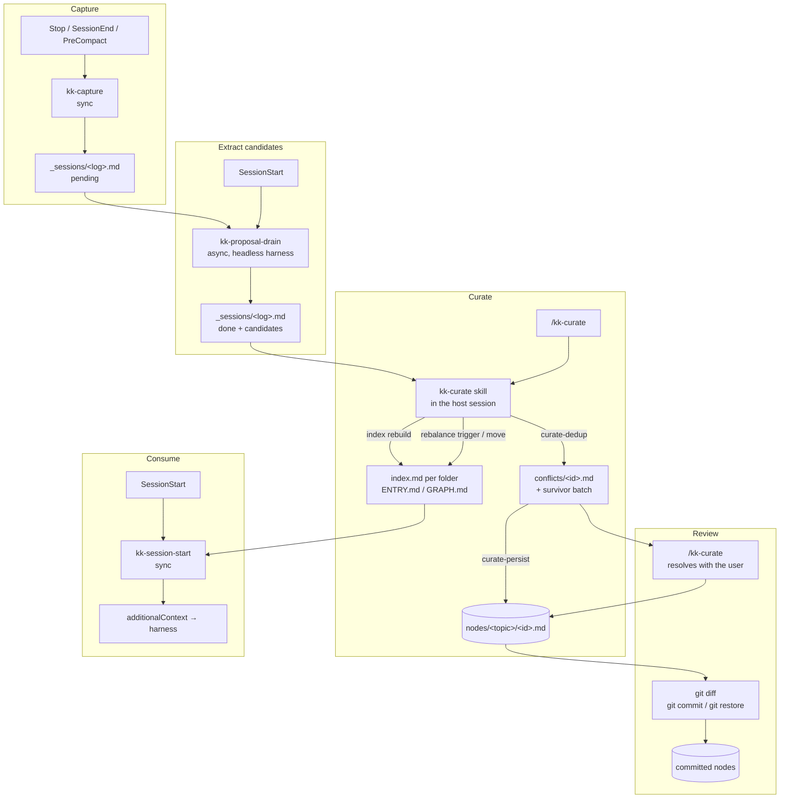

# Architecture

## Layout

```
src/
├── cli.ts               # Commander entry
├── commands/            # one file per subcommand
├── harnesses/           # one directory per adapter, plus types, registry, detect
│   └── <id>/hooks/      # hook sources, compiled per adapter
├── lib/                 # shared building blocks
└── templates-source/    # skills and prompts copied into consumer repos
```

`tsup` builds `dist/cli.js`. The `prepare` script copies `templates-source/` to `templates/` and drops the compiled hooks in. Never hand-edit `templates/`.

## Two kinds of command

**Primitives** never call an LLM: `init`, `doctor`, `status`, `lint`, `freshness`, `finddocs`, `node write`, `node sweep`, `session-log`, `curate-dedup`, `curate-persist`, `conflict prepare`, `drafts collect`, `rebalance`, `index rebuild`, `pack`, `logs prune`, `schema`, `validate`. Skills compose them. CI may call them directly.

`init --upgrade` calls `node sweep`'s core as its last step, which is the only place `init` writes to `nodes/`.

**Launchers** exec the host assistant against a skill. `curate`, `bootstrap`, and `node add` run `<harness> -p "/kk-<name>"` with `KENKEEP_BUILDER_INTERNAL=1` on the child. The LLM work happens in that session.

The one headless subprocess kenkeep spawns on its own is the proposal-drain hook, which runs the harness driver once per captured session to extract candidates.



## Pipelines


```mermaid
flowchart TB
    subgraph capture[Capture]
        H1[Stop / SessionEnd / PreCompact] --> KB1[kk-capture<br/>sync]
        KB1 --> SL[_sessions/&lt;log&gt;.md<br/>pending]
    end

    subgraph extract[Extract candidates]
        SS1[SessionStart] --> KB2[kk-proposal-drain<br/>async, headless harness]
        SL --> KB2
        KB2 --> SLD[_sessions/&lt;log&gt;.md<br/>done + candidates]
    end

    subgraph curate[Curate]
        UC["/kk-curate"] --> KB3[kk-curate skill<br/>in the host session]
        SLD --> KB3
        KB3 -->|curate-dedup| PC[conflicts/&lt;id&gt;.md<br/>+ survivor batch]
        PC -->|curate-persist| NODES[(nodes/&lt;topic&gt;/&lt;id&gt;.md)]
        KB3 -->|rebalance trigger / move| IDX[index.md per folder<br/>ENTRY.md / GRAPH.md]
        KB3 -->|index rebuild| IDX
    end

    subgraph review[Review]
        NODES --> RV[git diff<br/>git commit / git restore]
        PC --> SK["/kk-curate<br/>resolves with the user"]
        SK --> NODES
        RV --> COMMIT[(committed nodes)]
    end

    subgraph consume[Consume]
        SS2[SessionStart] --> KB4[kk-session-start<br/>sync]
        IDX --> KB4
        KB4 --> CTX[additionalContext → harness]
    end
```

Where the host exposes sub-agents (Claude Code and Cursor), curate and bootstrap draft in waves of up to five. Elsewhere they draft sequentially. Each run leaves a JSONL trace per batch under `_logs/`.

## State files

Committed: `nodes/`, `ENTRY.md`, `GRAPH.md`, `FOLDER_SUMMARIES.md`, `.config/prompts/`, `.state/installed-version`, and `conflicts/` until each is resolved. Gitignored: `_sessions/`, `_logs/`, `hooks/`, and the rest of `.state/` (`state.json`, `bootstrap-state.json`, `usage.jsonl`). Capture names logs `YYYYMMDD-HHmm-<sessionId>.md` and re-firing for the same session overwrites in place.

## Locking

Only the proposal-drain hook locks, with `proper-lockfile` on `state.json`, a heartbeat, and a 60 second stale threshold. A drain the host kills is reclaimed by the next drain within a minute.

Curate, bootstrap, and session-extract do not lock. Each runs single-author in one host session, and the primitives write atomically. Two concurrent curate runs are unsupported: the second one's session stamps may lose, and those sessions reprocess next time.

## Storage contract

- Leaves live in topical folders under `nodes/` at any depth. `type` is a facet that drives rendering, never placement.
- Every folder gets a generated `index.md`: a parent breadcrumb, `Load` pointers for child folders, `Open` pointers for leaves, and a `By topic` block naming the three most central whole-tree nodes per tag. No statistics in the body.
- `ENTRY.md`, `GRAPH.md`, and `FOLDER_SUMMARIES.md` sit outside the `nodes/` OKF bundle. The folder summary is the only authored field. It is harvested before every rebuild and re-stamped verbatim.
- Identity is `kk_id`. Nothing references a node by path, so moves never break links.
- `nodes_hash` covers leaves only, so rebuilding indexes never looks like drift.
- Generation is deterministic: sorted keys, stable order, no timestamps. `crypto.randomUUID()` is the only randomness, for run ids. Golden files in `tests/lib/index-gen.test.ts` pin this.

## Adapter interface

`src/harnesses/types.ts` defines `HarnessAdapter`: `id`, `launchBinary`, `launchArgsPrefix`, `hooks`, `paths`, `install`, `upgrade`, `parseTranscript`, `renderTranscript`, `runHeadless`, `buildHarnessOpts`, `doctorChecks`, `listMemoryFiles`, and an optional `detectFromEnv`. Register in `src/harnesses/registry.ts`. Step by step: [CONTRIBUTING.md](https://github.com/e0ipso/kenkeep/blob/main/CONTRIBUTING.md#adding-a-new-harness-adapter).

## Where to extend

Extraction lives in `src/templates-source/prompts/proposal-extract.md`. Curate and bootstrap live in their `SKILL.md.hbs` under `src/templates-source/skills/`, backed by the `curate-*`, `conflict-prepare`, `drafts-collect`, `finddocs`, and `node-write` commands. Rebalance thresholds are in `src/lib/rebalance.ts`. Any structured LLM contract is a Zod schema in `src/lib/schemas.ts`, named in `src/lib/schema-registry.ts`. A new subcommand is one file in `src/commands/` wired in `src/cli.ts`. A new hook is one file under `src/harnesses/<id>/hooks/` registered in that adapter's `hook-spec.ts`.
