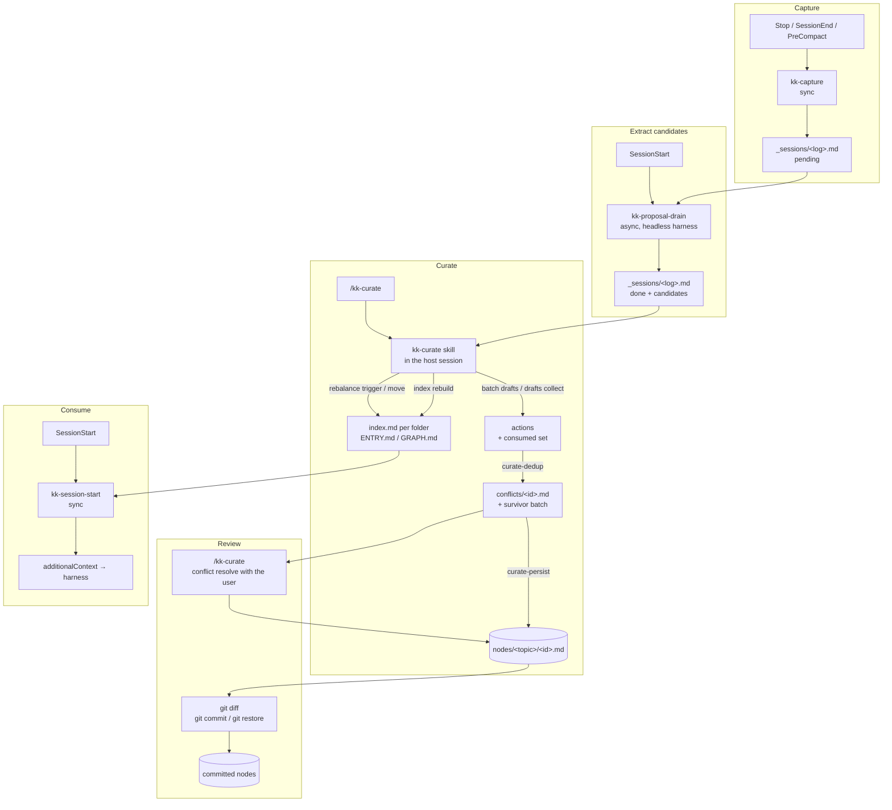

# Architecture

## Layout

```
src/
├── cli.ts               # Commander entry
├── commands/            # one file per subcommand
├── harnesses/           # one directory per adapter, plus types, registry, detect
│   └── <id>/hooks/      # hook sources, compiled per adapter
├── lib/                 # shared building blocks
└── templates-source/    # skills and prompts copied into consumer repos
```

`tsup` builds `dist/cli.js`. The `prepare` script copies `templates-source/` to `templates/` and drops the compiled hooks in. Never hand-edit `templates/`.

## Two kinds of command

**Primitives** never call an LLM: `init`, `doctor`, `status`, `lint`, `freshness`, `finddocs`, `node write`, `node sweep`, `node refresh-links`, `session-log`, `drafts collect`, `curate-dedup`, `curate-persist`, `conflict prepare`, `conflict resolve`, `memory mark`, `bootstrap complete-doc`, `place`, `rebalance`, `migrate`, `index rebuild`, `pack`, `logs prune`, `schema`, `validate`. Skills compose them. `memory list` is a primitive too but is not LLM-free: on Claude Code it finds the harness memory files with one headless `claude -p` call. CI may call them directly.

A primitive that reports a result writes one JSON document to stdout and every diagnostic to stderr, including the output of a command it drives (`stderrLog` and `writeJsonDocument` in `src/lib/log.ts`; the logger is passed down, never global). Skills and tests parse stdout whole. The no-op paths of `migrate status` and `place inventory` print a plain `nothing to do` line instead.

`init --upgrade` calls `node sweep`'s core as its last step, which is the only place `init` writes to `nodes/`. The sweep files a loose leaf from its own edges and tags. It deletes a leaf nothing fits only when nothing references it and git can restore it, and keeps every other one at the root.

**Launchers** exec the host assistant against a skill. `curate`, `bootstrap`, and `node add` run `<harness> -p "/kk-<name>"` with `KENKEEP_BUILDER_INTERNAL=1` on the child, plus the native model flags for `curatorModel` or `bootstrapModel` when configured (`launchModelArgs` on the adapter). The LLM work happens in that session.

The one headless subprocess kenkeep spawns on its own is the proposal-drain hook, which runs the harness driver once per captured session to extract candidates. Every headless call, including `npm run prompt-eval`, goes through `src/lib/headless-runner.ts`. It sends the prompt as an argument up to 64 KiB and through the host's stdin channel above that, and sets the recursion guard on the child. Each adapter keeps only its argv and result parsing.



## Pipelines


```mermaid
flowchart TB
    subgraph capture[Capture]
        H1[Stop / SessionEnd / PreCompact] --> KB1[kk-capture<br/>sync]
        KB1 --> SL[_sessions/&lt;log&gt;.md<br/>pending]
    end

    subgraph extract[Extract candidates]
        SS1[SessionStart] --> KB2[kk-proposal-drain<br/>async, headless harness]
        SL --> KB2
        KB2 --> SLD[_sessions/&lt;log&gt;.md<br/>done + candidates]
    end

    subgraph curate[Curate]
        UC["/kk-curate"] --> KB3[kk-curate skill<br/>in the host session]
        SLD --> KB3
        KB3 -->|batch drafts / drafts collect| MF[actions<br/>+ consumed set]
        MF -->|curate-dedup| PC[conflicts/&lt;id&gt;.md<br/>+ survivor batch]
        PC -->|curate-persist| NODES[(nodes/&lt;topic&gt;/&lt;id&gt;.md)]
        KB3 -->|rebalance trigger / move| IDX[index.md per folder<br/>ENTRY.md / GRAPH.md]
        KB3 -->|index rebuild| IDX
    end

    subgraph review[Review]
        NODES --> RV[git diff<br/>git commit / git restore]
        PC --> SK["/kk-curate<br/>conflict resolve with the user"]
        SK --> NODES
        RV --> COMMIT[(committed nodes)]
    end

    subgraph consume[Consume]
        SS2[SessionStart] --> KB4[kk-session-start<br/>sync]
        IDX --> KB4
        KB4 --> CTX[additionalContext → harness]
    end
```

Where the host exposes sub-agents (Claude Code and Cursor), curate and bootstrap draft in waves of up to five. Elsewhere they draft sequentially. Each run leaves a JSONL trace per batch under `_logs/`.

## State files

Committed: `nodes/`, `ENTRY.md`, `GRAPH.md`, `FOLDER_SUMMARIES.md`, `.config/prompts/`, `.state/installed-version` (the harness inventory), and `conflicts/`. A decided conflict stays on disk as a record until you commit or delete it. Gitignored: `_sessions/`, `_logs/`, `hooks/`, and the rest of `.state/` (`state.json`, `bootstrap-state.json`, `memory-ledger.json`, `usage.jsonl`). A team can commit session logs by replacing `/_sessions/` with `!/_sessions/` in `.ai/kenkeep/.gitignore`, and upgrades keep that line. Capture names logs `YYYYMMDD-HHmm-<sessionId>.md` and re-firing for the same session reuses the file.

Per-run curator state lives under `_logs/curator/`: `<run>__<n>.draft.json` (a batch's actions and the sessions it consumed, with their transcript hashes) and the JSONL traces. `logs prune` deletes only the `.jsonl` files.

## Locking

Only the proposal-drain hook locks, with `proper-lockfile` on `state.json`, a heartbeat, and a 60 second stale threshold. A drain the host kills is reclaimed by the next drain within a minute.

Curate, bootstrap, and session-extract do not lock. Each runs single-author in one host session, and the primitives write atomically. Two concurrent curate runs are unsupported: the second one's session stamps may lose, and those sessions reprocess next time.

## Storage contract

- Leaves live in topical folders under `nodes/` at any depth. `type` is a facet that drives rendering, never placement.
- Every folder gets a generated `index.md`: a parent breadcrumb, `Load` pointers for child folders, `Open` pointers for leaves, and a `By topic` block naming the three most central whole-tree nodes per tag. No statistics in the body.
- `ENTRY.md`, `GRAPH.md`, and `FOLDER_SUMMARIES.md` sit outside the `nodes/` OKF bundle. The folder summary is the only authored field. It is harvested before every rebuild and re-stamped verbatim.
- The owned output set is exactly `ENTRY.md`, `GRAPH.md`, `FOLDER_SUMMARIES.md`, and one `index.md` for the bundle root plus every folder with a leaf beneath it. `index rebuild` reads the tree once (one parse, one hash) and reconciles that whole set against the actual leaves: an `index.md` left in a leafless branch is removed (and the emptied folder with it), the branch's sidecar entry is pruned on the same run (recover it from git history if the folder returns), and `--stage` always regenerates and stages the complete set, deletions included; the leaf hash is never used to skip that work. `lint` reports `missing-folder-index` for an owned folder without an index and `stale-folder-index` for an index outside the owned set.
- Identity is `kk_id`. Nothing references a node by path, so moves never break links.
- Rendered links are leaf-relative. `src/lib/node-sections.ts` renders every Related, Depends on and Citations href relative to the leaf's own file, so GitHub and plain markdown readers resolve it. A repo-relative `kk_derived_from` path resolves through the leaf's `../` depth, a URL is linked as written, and a `<session>:<kind>:<index>` origin is plain text. An edge to an id the redirect ledger retired renders one link per live successor (`linkTargetResolver`, the same `resolveRedirect` lint and retrieval use), labelled `<id> → <successor>`; the frontmatter keeps the retired id. Because hrefs depend on location and on the ledger, rebalance, `node sweep`, and `pack import` call `refreshRenderedLinks` for the leaves they move, graft or retire and for the leaves linking to them (the ledger is written first), `lint` reports `stale-rendered-link` for a section a fresh render would change, and `node refresh-links` repairs it. A dangling edge is reported only as `dangling-edge`. `index rebuild` never rewrites a leaf.
- One write boundary. `src/lib/path-safety.ts` validates every node id, folder key, run id and contained path (no `..`, no absolute path, no symlinked directory). `atomicWriteFile` in `src/lib/fs-atomic.ts` writes every shared file through a unique temp name and a rename, so concurrent writers cannot collide and a failed write leaves no temp file.
- Multi-file mutations preflight before their first write. `rebalance move` resolves every operation against a simulated tree. `place apply` and `migrate okf-v3` validate the full output and write every destination before removing a source. An I/O error can still stop one part-way: `rebalance move` then prints the moves that landed, and a rerun of `migrate okf-v3` skips the leaves it already converted. `pack import` refuses to start unless `.ai/kenkeep/` and `AGENTS.md` are clean in git, and on failure prints the `git restore` and `git clean` commands that undo it.
- `nodes_hash` covers leaves only, so rebuilding indexes never looks like drift.
- Generation is deterministic: sorted keys, stable order, no timestamps. `crypto.randomUUID()` is the only randomness, for run ids. Golden files in `tests/lib/index-gen.test.ts` pin this.

## Adapter interface

`src/harnesses/types.ts` defines `HarnessAdapter`: `id`, `launchBinary`, `launchArgsPrefix`, `hooks`, `paths`, `install`, `upgrade`, `parseTranscript`, `renderTranscript`, `runHeadless`, `buildHarnessOpts`, `launchModelArgs` (native model flags for the launchers), `doctorChecks`, `listMemoryFiles`, and the optional `detectFromEnv`. Each installer writes its registration first, and that writer refuses a malformed user config before touching any file. Each adapter's `<id>Paths` in its `install.ts` is the one definition `paths`, `init` and `doctor` share. Register in `src/harnesses/registry.ts`. Step by step: [CONTRIBUTING.md](https://github.com/e0ipso/kenkeep/blob/main/CONTRIBUTING.md#adding-a-new-harness-adapter).

## Where to extend

Extraction lives in `src/templates-source/prompts/proposal-extract.md`. Curate and bootstrap live in their `SKILL.md.hbs` under `src/templates-source/skills/`, backed by the `curate-*`, `conflict-*`, `drafts-*`, `finddocs`, `node-write`, `bootstrap-complete-doc`, and `memory` commands. Rebalance thresholds are in `src/lib/rebalance.ts`. Any structured LLM contract is a Zod schema in `src/lib/schemas.ts`, named in `src/lib/schema-registry.ts`. A new subcommand is one file in `src/commands/` wired in `src/cli.ts`. A new hook is one file under `src/harnesses/<id>/hooks/` registered in that adapter's `hook-spec.ts`.
