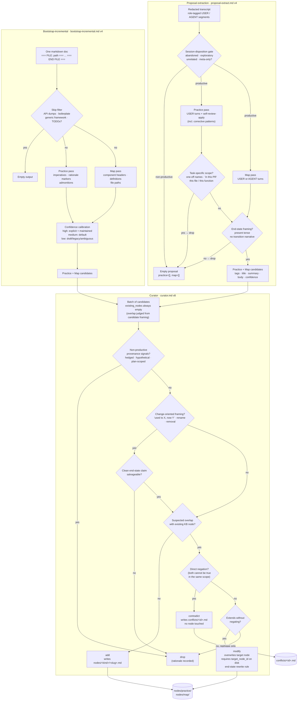

# Customizing prompts

The three LLM pipelines (proposal extraction, curator, bootstrap-incremental) each load their prompt from a local override path, falling back to the bundled template. To customize, edit the file under `.ai/knowledge-base/.config/prompts/`. Delete it to revert.

Bump the top-of-file `Version: N` comment on every behavior change; logs record the prompt content so historic decisions stay auditable.

## Prompt versions

- `proposal-extract.md` (v2): drives the async proposal-drain hook to convert a redacted transcript into structured practice and map candidates.
- `curator.md` (v3): consumes a batch of proposal outputs and the referenced existing nodes, emits add/modify/contradict/drop actions applied directly to `nodes/`.
- `bootstrap-incremental.md` (v2): converts a chunk of repo markdown into the same candidate shape as the proposal extractor, with provenance pointing back at source files.

| Pipeline | Local override | Bundled fallback |
|---|---|---|
| Proposal extraction | `.config/prompts/proposal-extract.md` | `templates/prompts/proposal-extract.md` |
| Curator | `.config/prompts/curator.md` | `templates/prompts/curator.md` |
| Bootstrap-incremental | `.config/prompts/bootstrap-incremental.md` | `templates/prompts/bootstrap-incremental.md` |

For the agent-driven `/kb-bootstrap` skill, edit `.claude/skills/kb-bootstrap/SKILL.md` instead.

## Pipeline overview

The three prompts form the knowledge-acquisition pipeline. Two extractors (one for live sessions, one for existing docs) emit candidate nodes; the curator decides what becomes a file on disk. The diagram below shows the gates, filters, and decisions inside each prompt.



Read top to bottom: each extractor short-circuits to an empty output when its gate fires; surviving candidates land in the curator, which routes every candidate to exactly one of four actions. The two extractors never interact - the curator is the only stage that writes to `nodes/` or `conflicts/`.

## Proposal prompt

The biggest quality lever in capture. Controls what the extractor treats as worth remembering.

### Sections

1. **Version comment**.
2. **What to extract** - practice/map definitions, trigger phrases.
3. **What to skip** - typos, file reads, agent paraphrases, generic programming knowledge. Also: non-productive sessions (abandoned, exploratory, cursory, unrelated, meta-only) short-circuit to `{"practice": [], "map": []}` via the session-disposition gate at the top of the prompt; the gate fires when the session as a whole does not converge on durable knowledge.
4. **Ownership boundary** - how to split combined statements between practice and map.
5. **Inline example** - a worked transcript with expected JSON.
6. **Output schema** - must match `ProposalOutputSchema`.

The drain replaces `[TRANSCRIPT PLACEHOLDER, substituted at runtime]` with the redacted slice. If the placeholder is removed, the transcript is appended at the end.

### Calibration

Fixtures under `tests/fixtures/transcripts/`:

- `routine-zero/` - a session with no teaching moments. Correct output is empty.
- `bravo-insider/` - 4 practice + 3 map candidates. `expected.md` is the target.

Mocked tests pin the schema; only real `claude -p` reveals prompt quality. Run the fixtures with the real CLI before shipping changes.

### Schema

Output shape must match `ProposalOutputSchema` in `src/lib/schemas.ts`. New fields mean extending the Zod schema. Bump `schema_version` on rename, removal, or semantic change; new optional fields don't bump.

## Curator prompt

Decides what happens to every proposal candidate: add, modify, contradict, or drop. Second-biggest quality lever.

### Input

`[BATCH PLACEHOLDER]` is replaced with:

```json
{
  "existing_nodes": [
    { "id": "...", "title": "...", "kind": "practice", "tags": ["..."], "summary": "...", "body": "..." }
  ],
  "batch": [
    {
      "session_id": "...",
      "captured_at": "...",
      "derived_from": "session-<id>.md",
      "practice_candidates": [...],
      "map_candidates": [...]
    }
  ]
}
```

`existing_nodes` carries only nodes referenced by `supports_existing_node` / `contradicts_existing_node` in the batch. The curator is told to `drop` any candidate that appears to overlap an existing node not provided in `existing_nodes`, with a rationale naming the suspected overlap.

### Output

A single JSON array. Each element:

```json
{
  "action": "add | modify | contradict | drop",
  "candidate_origin": "<session_id>:<practice|map>:<index>",
  "target_node_id": "<id-or-null>",
  "proposed_node": { /* full node, or null for drop */ },
  "rationale": "...",
  "suggested_resolution": null
}
```

The wrapper applies actions directly:

- `add` writes `nodes/<kind>/<id>.md`. If the file already exists, the wrapper records an `add_collision` failure and writes nothing.
- `modify` overwrites `nodes/<kind>/<target_node_id>.md`. If the target file doesn't exist, the wrapper records a `modify_missing_target` failure.
- `contradict` writes nothing - the wrapper records the conflict in `.ai/knowledge-base/.state/pending-conflicts.json` for the kb-curate skill to surface to the user in-session.
- `drop` is a no-op.

`suggested_resolution` is ignored by the wrapper (always emit `null`); resolution happens via the kb-curate skill walking `pending-conflicts.json` with the user.

### Verifying

1. `npm test` - curate tests assert add/modify write the right `nodes/<kind>/<id>.md`, contradict appears in `result.conflicts`, collisions and missing targets land in `result.failures`.
2. Inspect `_logs/curator/<run-id>__<ts>.jsonl` for the final array (no preamble).

### Anti-patterns

- Modifications that rephrase existing content (drop instead).
- Additions when a near-duplicate exists (modify instead).
- Suggesting a `suggested_resolution` value (it's ignored - the user picks via the kb-curate skill).
- Crossing the practice/map boundary.
- Change-oriented framing (transition narratives, migration stories, rename or removal logs): automatic drop regardless of confidence, unless a clean end-state claim can be salvaged.
- Non-productive provenance signatures: candidates whose framing carries hedged wording, references to hypothetical entities, plan-scoped or task-scoped wording, or low-confidence-without-rationale are dropped. The curator weighs these signals together (not any single one in isolation) and treats a combined signature as evidence the candidate originated from an abandoned, exploratory, cursory, unrelated, or meta-only session that slipped the extractor's session-disposition gate.

## Bootstrap-incremental prompt

Controls what `bootstrap-incremental` treats as candidates from your source docs.

### Sections

1. **Inputs** - chunk format (`=== FILE: <path> ===` ... `=== END FILE ===`).
2. **Output** - JSON shape and candidate fields.
3. **What to extract** - trigger patterns per kind.
4. **What to skip** - auto-generated reference, licenses, generic framework knowledge, aspirational TODOs.
5. **Confidence calibration**.
6. **Rules** - never invent facts, quote rationale verbatim, emit only the JSON object.

The chunk replaces `[CHUNK PLACEHOLDER, substituted at runtime]`. If removed, the chunk is appended.

### Calibration loop

1. Pick 3–5 representative docs.
2. `bootstrap-incremental --from <subset> --dry-run`.
3. Run without `--dry-run`. Review proposals.
4. Note false positives and false negatives. Adjust "trigger patterns" and "what to skip".
5. Delete `bootstrap-state.json` and re-run.
6. Repeat until acceptance lands around 60–80%. Higher rates tend to drop true positives.

## Reading run logs

Every LLM pipeline writes a stream-JSON trace under `.ai/knowledge-base/_logs/`. Gitignored.

### Proposal - `_logs/proposal/<session-id>__<ts>.jsonl`

| Line type | What it is |
|---|---|
| `system / init` | Records session id and resolved model. |
| `assistant` | Intermediate streamed turns. |
| `user` | Rare follow-ups. |
| `result` | Final message. Parsed as JSON, validated against `ProposalOutputSchema`. |

Common failures:

- **No final result** - `claude` was killed or timed out. Check timestamps. The drain writes `proposal_status: failed` and does not retry on its own; these failure modes do not heal on retry.
- **Schema mismatch** - model emitted extra prose or skipped a field. Inspect `result` text; tune the prompt if consistent.

To force re-extraction of a `failed` entry: set `proposal_status: pending` in the session log and clear `proposal_error`. The next drain sweep will pick it up.

### Curator - `_logs/curator/<run-id>__<ts>.jsonl`

| `type` | What it is |
|---|---|
| `assistant` | Streamed reasoning. |
| `tool_use` | A `Read` against an existing node (curator's only allowed tool). |
| `tool_result` | Output of the `Read`. |
| `result` | Final message. Validated against `CuratorOutputSchema`. |

Common issues:

- **`nodesWritten: 0` despite a non-empty batch** - check the final `result` for `is_error: true`, then check `failures` and `conflicts` in the curate output: every action either writes, fails, conflicts, or drops.
- **Fenced JSON** - `runHeadlessClaude` parses the trimmed final result with `JSON.parse` directly; the curator prompt forbids fences, so a fenced or pre-amble-laden response fails parsing and is reported.
- **Duplicates after dedup** - cross-batch dedup keeps the higher-confidence action per `proposed_node.id`. Duplicates mean inconsistent slugification produced different ids.
- **Conflict not surfacing in `/kb-curate`** - verify `.ai/knowledge-base/.state/pending-conflicts.json` exists and contains the entry. The skill reads from there.

To re-run a single batch (no first-class command): clear `curator_processed_at` and `curator_run_id` from the affected session log and re-run `curate`.

### Privacy

Logs contain the **redacted** transcript. Secrets secretlint caught are redacted; secrets it missed could appear. Treat `_logs/` with the same care as `_sessions/`. Both gitignored by default.
