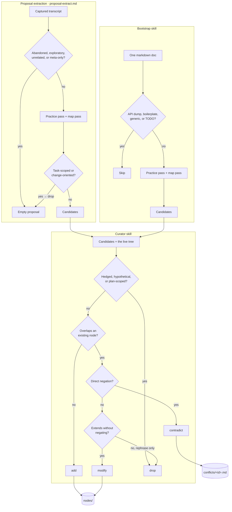

# Prompts and schemas

Two prompts decide what the knowledge base keeps. The proposal extractor turns a transcript into candidates. The curator turns candidates into files. Bootstrap is a third extractor fed by docs instead of transcripts.

## Where each prompt lives

`proposal-extract.md` runs in the drain's headless driver, or inline in `/kk-curate` on Claude Code. Override it, along with `knowledge-admission.md` and `sub-agent-delegation.md`, under `.ai/kenkeep/.config/prompts/`. The skills (`kk-curate`, `kk-bootstrap`, `kk-add`, `kk-session-extract`, `kk-migrate`) run in your session, and their per-harness `SKILL.md` copy is the override. Canonical sources are `src/templates-source/skills/*/SKILL.md.hbs`. Bump the `Version:` comment on every behavior change.

## The durability filter

Every extractor and the curator apply the same test from `knowledge-admission.md`: keep principles and current-state facts, drop actions and story. Maintenance steps, ticket references, migration narratives, and one-off facts dressed as practices are the usual rejections.

## Pipeline


```mermaid
flowchart TB
    subgraph proposal["Proposal extraction · proposal-extract.md"]
        direction TB
        PI["Captured transcript"]
        PG{"Abandoned, exploratory,<br/>unrelated, or meta-only?"}
        PEMPTY["Empty proposal"]
        PP["Practice pass + map pass"]
        PF{"Task-scoped or<br/>change-oriented?"}
        PO["Candidates"]
        PI --> PG
        PG -- "yes" --> PEMPTY
        PG -- "no" --> PP
        PP --> PF
        PF -- "yes → drop" --> PEMPTY
        PF -- "no" --> PO
    end

    subgraph bootstrap["Bootstrap skill"]
        direction TB
        BI["One markdown doc"]
        BS{"API dump, boilerplate,<br/>generic, or TODO?"}
        BSKIP["Skip"]
        BP["Practice pass + map pass"]
        BO["Candidates"]
        BI --> BS
        BS -- "yes" --> BSKIP
        BS -- "no" --> BP
        BP --> BO
    end

    subgraph curator["Curator skill"]
        direction TB
        CI["Candidates + the live tree"]
        CG{"Hedged, hypothetical,<br/>or plan-scoped?"}
        COV{"Overlaps an<br/>existing node?"}
        CNEG{"Direct negation?"}
        CEXT{"Extends without<br/>negating?"}
        CADD["add"]
        CMOD["modify"]
        CCON["contradict"]
        CDROP["drop"]
        CI --> CG
        CG -- "yes" --> CDROP
        CG -- "no" --> COV
        COV -- "no" --> CADD
        COV -- "yes" --> CNEG
        CNEG -- "yes" --> CCON
        CNEG -- "no" --> CEXT
        CEXT -- "yes" --> CMOD
        CEXT -- "no, rephrase only" --> CDROP
    end

    PO --> CI
    BO --> CI
    CADD --> NODES[("nodes/")]
    CMOD --> NODES
    CCON --> CONF[("conflicts/&lt;id&gt;.md")]
```

The curator is the only stage that writes to `nodes/` or `conflicts/`, through two primitives. `curate-dedup` collapses duplicate actions, writes conflict files, and stamps the source logs. `curate-persist` writes every surviving add or modify and reports each result with its placement. A missing modify target or an unresolved id collision comes back as `failed`, never silently.

## Rebalance trigger

The last phase of `/kk-curate` calls `rebalance trigger`, a pure function in `src/lib/rebalance.ts`. Each rule sits past a hysteresis margin so one borderline leaf cannot flip a folder back and forth.

| Action | Fires when |
|---|---|
| split-folder | a folder holds more than 12 direct leaves |
| merge | a childless non-root folder holds fewer than 2 leaves |
| split-leaf | a leaf exceeds 1500 estimated tokens and carries at least 3 distinct tags |
| create-branch | root leaves have no edges; those sharing a tag are grouped into one action |

An empty decision skips the LLM step. When the LLM clusters, it also writes the one-line summary for each new folder, as a lowercase fragment with no trailing period, because it completes the rendered "for more information on ..." prefix.

## Node frontmatter

Leaves are [OKF v0.1](https://github.com/GoogleCloudPlatform/knowledge-catalog/blob/main/okf/SPEC.md) concept documents. The four bare keys are OKF's. Everything kenkeep adds sits under `kk_`.

```yaml
---
type: practice | map
title: "..."
description: "one-line summary"
tags: [string, ...]
kk_schema_version: 3
kk_id: practice-prefer-constructor-injection   # <type>-<slug>, the identity
kk_derived_from: [20260510-1014-session-abc.md]
kk_relates_to: [string, ...]
kk_depends_on: [string, ...]
kk_confidence: low | medium | high
---
```

A fenced `Related` block and a numbered `# Citations` block are regenerated from those arrays on every write. Prose outside the fences is never touched. There are no timestamps. Git history is the timeline.

## Every other shape

`src/lib/schemas.ts` is the source of truth, and a mismatch drops the file silently. Print any contract as JSON Schema, or validate a file against it:

```sh
npx kenkeep schema node
npx kenkeep validate curator-output actions.json
```

Names: `node`, `proposed-node`, `proposal-output`, `curator-output`, `pack-manifest`.

Session logs carry `session_id`, `captured_by`, `proposal_status` (`pending`, `done`, `failed`, `skipped`), the extracted `proposals`, and `curator_processed_at` once curated. `ENTRY.md` and `GRAPH.md` carry `schema_version`, `node_count`, and `nodes_hash`, a `sha256` over the sorted `path\tsha256(contents)` lines of every leaf, excluding generated indexes.

## Run logs and privacy

The drain writes one stream-JSON trace per session under `_logs/proposal/`. No `result` line means the driver was killed or timed out. Curate and bootstrap leave their reasoning in the host session transcript instead.


