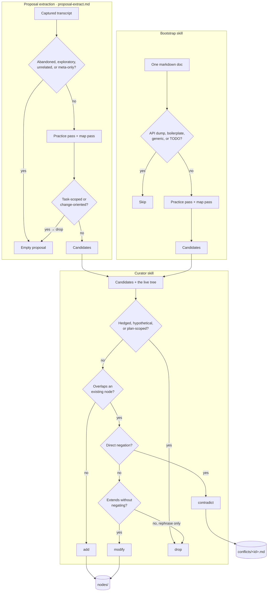

# Prompts and schemas

Two prompts decide what the knowledge base keeps. The proposal extractor turns a transcript into candidates. The curator turns candidates into files. Bootstrap is a third extractor fed by docs instead of transcripts.

## Where each prompt lives

`proposal-extract.md` runs in the drain's headless driver, or inline in `/kk-curate` on Claude Code. Override it, along with `knowledge-admission.md` and `sub-agent-delegation.md`, under `.ai/kenkeep/.config/prompts/`. The skills (`kk-curate`, `kk-bootstrap`, `kk-add`, `kk-session-extract`, `kk-migrate`) run in your session, and their per-harness `SKILL.md` copy is the override. Canonical sources are `src/templates-source/skills/*/SKILL.md.hbs`. Bump the `Version:` comment on every behavior change. Prompt versions are independent of the npm version, and a prompt change goes in the release notes so users know to diff their overrides.

## The durability filter

Every extractor and the curator apply the same test from `knowledge-admission.md`: keep principles and current-state facts, drop actions and story. Maintenance steps, ticket references, migration narratives, and one-off facts dressed as practices are the usual rejections.

## Pipeline


```mermaid
flowchart TB
    subgraph proposal["Proposal extraction · proposal-extract.md"]
        direction TB
        PI["Captured transcript"]
        PG{"Abandoned, exploratory,<br/>unrelated, or meta-only?"}
        PEMPTY["Empty proposal"]
        PP["Practice pass + map pass"]
        PF{"Task-scoped or<br/>change-oriented?"}
        PO["Candidates"]
        PI --> PG
        PG -- "yes" --> PEMPTY
        PG -- "no" --> PP
        PP --> PF
        PF -- "yes → drop" --> PEMPTY
        PF -- "no" --> PO
    end

    subgraph bootstrap["Bootstrap skill"]
        direction TB
        BI["One markdown doc"]
        BS{"API dump, boilerplate,<br/>generic, or TODO?"}
        BSKIP["Skip"]
        BP["Practice pass + map pass"]
        BO["Candidates"]
        BI --> BS
        BS -- "yes" --> BSKIP
        BS -- "no" --> BP
        BP --> BO
    end

    subgraph curator["Curator skill"]
        direction TB
        CI["Candidates + the live tree"]
        CG{"Hedged, hypothetical,<br/>or plan-scoped?"}
        COV{"Overlaps an<br/>existing node?"}
        CNEG{"Direct negation?"}
        CEXT{"Extends without<br/>negating?"}
        CADD["add"]
        CMOD["modify"]
        CCON["contradict"]
        CDROP["drop"]
        CI --> CG
        CG -- "yes" --> CDROP
        CG -- "no" --> COV
        COV -- "no" --> CADD
        COV -- "yes" --> CNEG
        CNEG -- "yes" --> CCON
        CNEG -- "no" --> CEXT
        CEXT -- "yes" --> CMOD
        CEXT -- "no, rephrase only" --> CDROP
    end

    PO --> CI
    BO --> CI
    CADD --> NODES[("nodes/")]
    CMOD --> NODES
    CCON --> CONF[("conflicts/&lt;id&gt;.md")]
```

The curator is the only stage that writes to `nodes/` or `conflicts/`, through deterministic primitives. The action contract is a discriminated union (`npx kenkeep schema curator-output`): `add` and `modify` carry a proposed node, `modify` also a target id, `contradict` a target id and a rationale (the proposed node is optional), `drop` an origin and a rationale.

Each batch draft lists the sessions it consumed, with their transcript hashes, next to its actions. `drafts collect` merges the valid drafts into one `{ runId, batches, consumed, actions }` document. An invalid draft, or a batch that wrote none, contributes nothing, and its sessions stay pending. `curate-dedup` takes that document and validates it before any write. It collapses duplicate actions with keys namespaced per action kind, so a contradiction is never absorbed by a modify. A modify whose target has a contradiction is held as a second conflict. It writes the conflict files and stamps exactly the consumed sessions, each with the transcript version it consumed. `curate-persist` writes every surviving add or modify and reports each result with its placement. Before writing an add it looks for a leaf that already carries the action's origin with the same fields and body, and it skips a modify that would change nothing, so a rerun of the same survivors writes only what has not landed. A missing modify target or an unresolved id collision comes back as `failed`, never silently.

Conflicts are resolved by `conflict prepare` (read-only, stamps each default decision) and `conflict resolve` (applies one decision; accept rewrites the target in place by id). Conflict files are `schema_version: 2`. They carry the full proposal and a `status` of `pending`, `skipped`, `accepted`, `rejected` or `kept`.

## Rebalance trigger

The last phase of `/kk-curate` calls `rebalance trigger`, a pure function in `src/lib/rebalance.ts`. Each rule sits past a hysteresis margin so one borderline leaf cannot flip a folder back and forth.

| Action | Fires when |
|---|---|
| split-folder | a folder holds more than 12 direct leaves |
| merge | a childless non-root folder holds fewer than 2 leaves |
| split-leaf | a leaf exceeds 1500 estimated tokens and carries at least 3 distinct tags |
| create-branch | root leaves have no edges; those sharing a tag are grouped into one action |

An empty decision skips the LLM step. When the LLM clusters, it also writes the one-line summary for each new folder, as a lowercase fragment with no trailing period, because it completes the rendered "for more information on ..." prefix.

## Node frontmatter

Leaves are [OKF v0.1](https://github.com/GoogleCloudPlatform/knowledge-catalog/blob/main/okf/SPEC.md) concept documents. The four bare keys are OKF's. Everything kenkeep adds sits under `kk_`.

```yaml
---
type: practice | map
title: "..."
description: "one-line summary"
tags: [string, ...]
kk_schema_version: 3
kk_id: practice-prefer-constructor-injection   # <type>-<slug>, the identity
kk_derived_from: [20260510-1014-session-abc.md]
kk_relates_to: [string, ...]
kk_depends_on: [string, ...]
kk_confidence: low | medium | high
---
```

A fenced `Related` block and a numbered `# Citations` block are regenerated from those arrays on every write. Prose outside the fences is never touched. There are no timestamps. Git history is the timeline.

## Every other shape

`src/lib/schemas.ts` is the source of truth, and a mismatch drops the file silently. Print any contract as JSON Schema, or validate a file against it:

```sh
npx kenkeep schema node
npx kenkeep validate curator-output actions.json
```

Names: `node`, `proposed-node`, `proposal-output`, `curator-output`, `curator-draft`, `pack-manifest`, `conflict`.

Session logs carry `session_id`, `captured_by`, `transcript_hash` / `transcript_chars` (the transcript version), `proposal_status` (`pending`, `done`, `failed`, `skipped`), the extracted `proposals`, and once curated `curator_processed_at` / `curator_run_id` with `curated_transcript_hash` / `curated_transcript_chars` naming the version consumed (see [hooks](hooks.md#transcript-versions)). `ENTRY.md` and `GRAPH.md` carry `schema_version`, `node_count`, and `nodes_hash`, a `sha256` over the sorted `path\tsha256(contents)` lines of every leaf, excluding generated indexes.

## Run logs and privacy

The drain writes one stream-JSON trace per session under `_logs/proposal/`. No `result` line means the driver was killed or timed out. Curate and bootstrap leave their reasoning in the host session transcript instead, plus per-batch JSONL traces and drafts under `_logs/curator/`.

## Prompt evaluation

`npm run prompt-eval -- --harness <id>` runs one headless call per frozen fixture through the same runner the drain uses, then judge calls for the fixtures that need one. Both prompts substitute the transcript or candidate literally, so `$&` and `$'` in a fixture reach the model unchanged. Large prompts go through the host's stdin channel rather than argv. Run it before bumping `proposal-extract.md` or `knowledge-admission.md`. The procedure is in [CONTRIBUTING.md](https://github.com/e0ipso/kenkeep/blob/main/CONTRIBUTING.md#prompt-evaluation).


